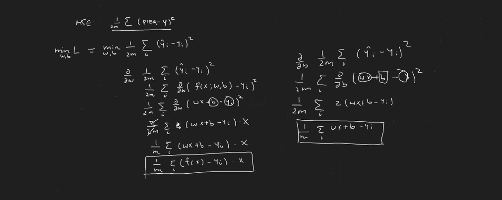

# Practica 1

Implementacion de descenso de gradiente(numpy), limpieza de datos (pandas), modelado(scikit-learn), visualizacion de datos (matplotlib).



# Tarea 1
- [Prediccion de salario](https://www.kaggle.com/datasets/krishnaraj30/salary-prediction-data-simple-linear-regression)
- [Prediccion de puntaje](https://www.kaggle.com/datasets/himanshunakrani/student-study-hours)

## Indicaciones:
- Descargar y descomprimir los archivos csv.
- Realizar limpieza y analisis de datos.
- Modelado.
- Visualizacion.

# Tarea 2
Realizar una implementacion de regresion lineal en numpy dada la siguiente funcion:

$f(x_1, x_2) = w_1 x_1 + w_2 x_2 + b$

Probar funcionamiento con los siguientes arreglos:

```python
x_1 = np.array([0,1,2,3,4])
x_2 = np.array([0,1,2,3,4])
y = np.array([3, 7, 11, 15, 19])
```

Salida esperada:
$f(x_1, x_2) = 2 x_1 + 2 x_2 + 3$
